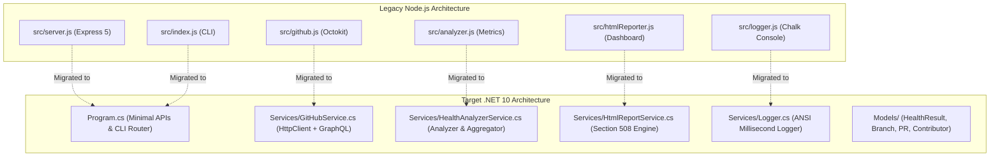
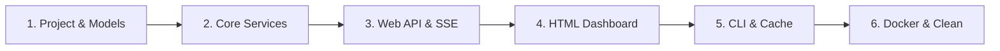

# 🚀 Migration Plan: Node.js to .NET 10

<div align="center">


</div>

---

## 📋 Executive Summary

This document specifies the architectural transition of **`fluffy-sniffle`** from a Node.js / Express 5 application to a high-performance **.NET 10 (C# 13) / ASP.NET Core Minimal APIs** solution.

The migration preserves **100% functional parity** with the existing solution, including:
- Dual-engine GitHub querying (GraphQL with authenticated 5,000 req/hr rate limits + unauthenticated REST fallback).
- Repository health auditing: stale branch detection (30d stale, 60d warning) and pull request lifecycle tracking (Open, Merged, Closed, Draft).
- Cross-repository contributor leaderboard and review bottleneck analysis.
- Accessible HTML dashboard with **4 visual themes** (Dark, Light, Midnight, High Contrast) meeting **Section 508 / WCAG 2.1 AAA** standards.
- Instant client-side global search across branches, PRs, and contributors with keyword highlighting.
- In-browser interactive actions: "Run Report Now", "Add Repo" (with pre-validation against GitHub), and "Remove Repo".
- Live Auto-Reload with Server-Sent Events (SSE) and `dotnet watch`.
- Precise request duration logging (in milliseconds) for all HTTP endpoints and GitHub API calls.
- Multi-stage Alpine containerization via Docker and Docker Compose.

---

## 🏛️ Component Mapping & Architecture



### Direct File Mapping Table

| Node.js Component | .NET 10 Replacement | Primary Responsibility |
| :--- | :--- | :--- |
| `package.json` | `fluffy-sniffle.csproj` | Project dependencies, author metadata, SDK target (`net10.0`) |
| `src/server.js` | `Program.cs` | Kestrel server, Minimal API routes, SSE live-reload, request timing middleware |
| `src/index.js` | `Program.cs` (CLI args router) | Terminal execution mode, Markdown report export, ad-hoc repository scanning |
| `src/github.js` | `Services/GitHubService.cs` | GraphQL + REST client, topic rejection, input URL sanitization |
| `src/analyzer.js` | `Services/HealthAnalyzerService.cs` | Branch staleness logic, open PR association, contributor aggregation |
| `src/htmlReporter.js` | `Services/HtmlReportService.cs` | Standalone HTML rendering, 4 accessible themes, client-side search scripts |
| `src/logger.js` | `Services/Logger.cs` | Millisecond timestamped ANSI terminal logging |
| `config.json` | `config.json` | Shared configuration (deserialized via `System.Text.Json`) |
| `Dockerfile` | `Dockerfile` | Multi-stage build with `mcr.microsoft.com/dotnet/sdk:10.0-alpine` |

---

## ⚡ Phased Migration Roadmap



### Phase 1: Project Setup & Domain Models
- Generate `fluffy-sniffle.csproj` targeting `net10.0`.
- Define immutable records in `Models/`:
  - `RepositoryHealthResult`, `BranchInfo`, `PullRequestInfo`, `ContributorActivity`.
  - `AppConfig`, `RepoConfig`.

### Phase 2: GitHub API Service & Health Analyzer
- Implement `GitHubService`:
  - Batched GraphQL query for repository health.
  - REST fallback for unauthenticated public scans.
  - Duration measurement with `Stopwatch` on every request.
  - Repository URL sanitization and GitHub Topic detection.
- Implement `HealthAnalyzerService`:
  - Branch age calculation ($\ge 30\text{d}$ stale, $\ge 60\text{d}$ warning).
  - Cross-repo contributor aggregation with review workload ranking.

### Phase 3: ASP.NET Core Minimal APIs & Live Reload
- Configure Kestrel on port 3000 (`http://localhost:3000`).
- Map all endpoints:
  - `GET /`
  - `POST /api/scan`
  - `GET /api/data`
  - `GET /api/repos`
  - `POST /api/repos`
  - `DELETE /api/repos/{owner}/{repo}`
  - `GET /api/live-reload` (Server-Sent Events)
- Implement HTTP duration logging middleware:
  - Logs `[ACTION: HTTP Request] METHOD /path -> STATUS (XXms)`.

### Phase 4: HTML Dashboard & Section 508 Parity
- Implement `HtmlReportService`:
  - All 4 visual themes (`dark`, `light`, `midnight`, `high-contrast`).
  - Section 508 keyboard accessibility (`skip-link`, `:focus-visible`, semantic headers).
  - Client-side live search and contributor scope toggles.
  - SSE client auto-reconnecting on `dotnet watch` restarts.

### Phase 5: CLI Mode & Disk Caching
- Support command-line switches:
  - `--cli` (Terminal overview tables via Spectre.Console).
  - `--markdown` (Export to `reports/repo-health-*.md`).
  - Ad-hoc repo scanning (`dotnet run -- facebook/react`).
- Implement disk caching (`reports/.cache.json`) for instant (< 50ms) startup.

### Phase 6: Multi-Stage Dockerfile & Docs
- Multi-stage Alpine containerization:
  - Build stage: `mcr.microsoft.com/dotnet/sdk:10.0-alpine`.
  - Runtime stage: `mcr.microsoft.com/dotnet/aspnet:10.0-alpine`.
  - Non-root user security.
- Update `README.md` and `docker-compose.yml`.

---

## 🛠️ Developer Commands in .NET

```bash
# 1. Run Web Dashboard (Production / Standard Mode):
dotnet run

# 2. Run with Live Auto-Reload (Development Mode):
dotnet watch run

# 3. Run in Terminal / CLI Mode:
dotnet run -- --cli

# 4. Scan a single ad-hoc repository:
dotnet run -- facebook/react

# 5. Export Markdown report:
dotnet run -- --markdown

# 6. Containerized execution:
docker compose up -d
```

---

*Author: **EldieBeldie** (<eldargr@gmail.com>)*
