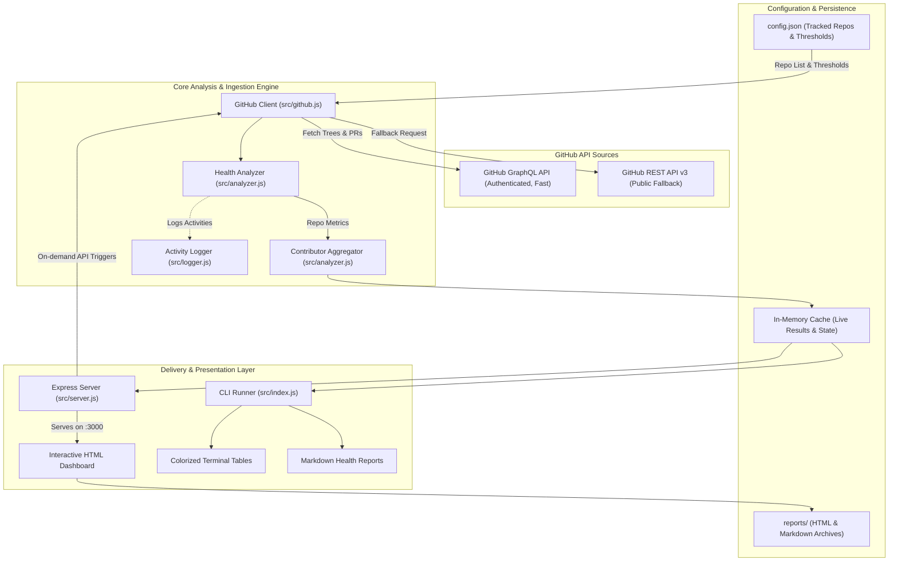
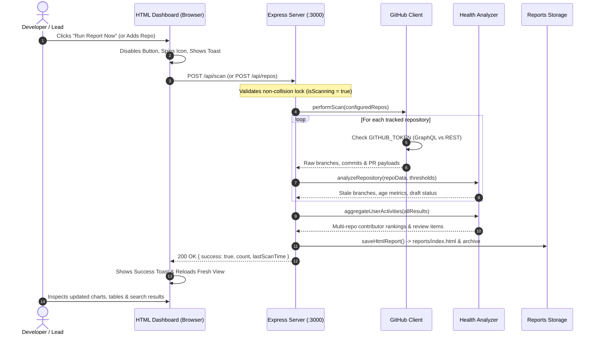
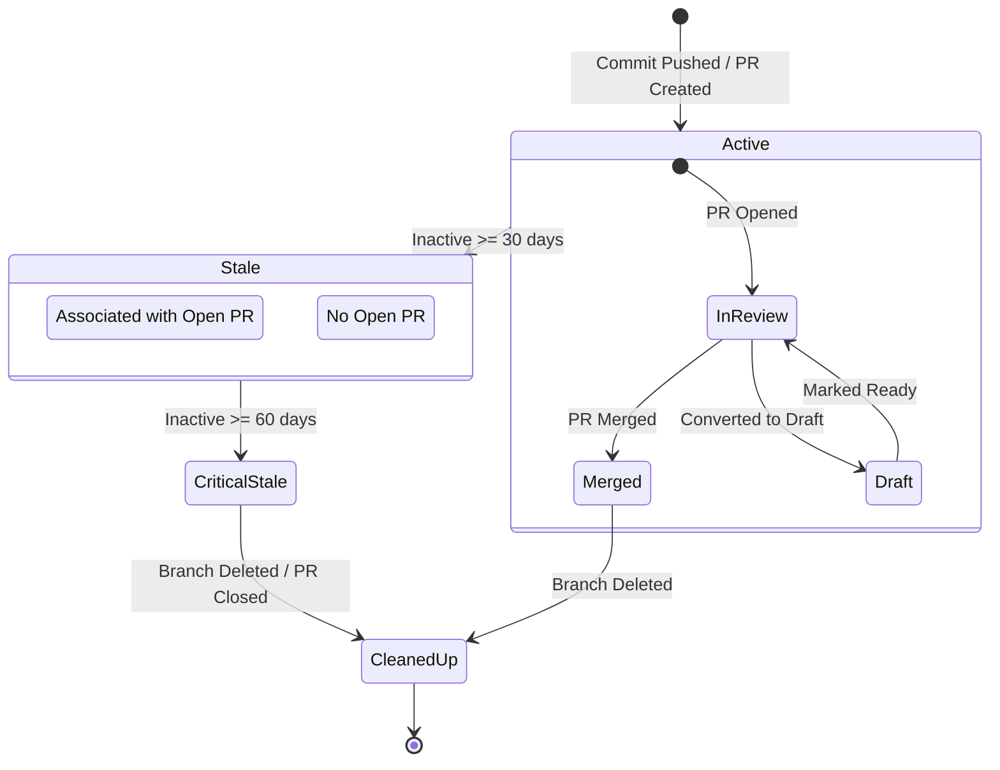

# fluffy-sniffle 🔍⚡

<div align="center">


<br/>

**An enterprise-grade, real-time GitHub repository health & contributor analytics engine.**  
*Track stale branches, audit open pull requests, benchmark team activities, and eliminate technical debt across multiple repositories.*

</div>

---

## 👤 Author & Creator

| Detail | Information |
| :--- | :--- |
| **Creator & Owner** | **EldieBeldie** |
| **GitHub** | [@EldieBeldie](https://github.com/EldieBeldie) |
| **Email** | [eldargr@gmail.com](mailto:eldargr@gmail.com) |
| **Code Ownership** | Defined in [`.github/CODEOWNERS`](.github/CODEOWNERS) (`@EldieBeldie`) |
| **Project** | [fluffy-sniffle](https://github.com/EldieBeldie/fluffy-sniffle) |

> *"Built to provide engineering teams with crystal-clear visibility into repository hygiene, cross-project contributor momentum, and open PR bottlenecks without friction."*

---

## 🏛️ System Architecture

`fluffy-sniffle` is architected as an event-driven, dual-engine inspection pipeline. It seamlessly connects with GitHub via authenticated GraphQL or unauthenticated REST, processes branch and PR trees through a multi-pass analyzer, aggregates developer metrics cross-repository, and delivers real-time intelligence via an Express web server, interactive HTML dashboard, and CLI runner.

### 📐 High-Level Architectural Flow



---

### 🔄 In-Page On-Demand Scan Sequence

When you trigger a scan directly from the web interface, the following asynchronous lifecycle executes:



---

### 🍂 Branch & PR Staleness Lifecycle State Machine



---

## ✨ Features & Capabilities

- **⚡ Blazing Multi-Repository Audits:** Monitor dozens of repositories simultaneously without touching Git locally.
- **🏢 Repository Health View:** Inspect default branches, private/public status, and categorized branch lists with staleness counters.
- **👤 Contributor Activities Leaderboard:** Cross-project activity aggregation showing who authors open PRs, which developers own stale branches, and who has pending reviews.
- **🔍 Global Instant Search Engine:**
  - Full-text search across PR titles, PR numbers, branch names, commit authors, and repository names.
  - Category filter chips: `All`, `Pull Requests`, `Branches`, `Contributors`, `Repositories`.
  - In-place `<mark>` keyword highlighting.
  - Keyboard shortcuts: Press <kbd>/</kbd> to focus, <kbd>Escape</kbd> to clear.
- **🔄 In-Browser Interactive Controls:**
  - **"Run Report Now" button:** Trigger fresh scans on demand with zero page reloads needed.
  - **"Add Repo" input:** Add new repositories (`owner/repo`) right from the web header to persist and scan instantly.
- **📡 Dual API Architecture:**
  - **GraphQL (Primary):** Authenticated via `GITHUB_TOKEN` for 5,000 req/hr rate limit and batched single-query tree fetches.
  - **REST v3 (Fallback):** Works unauthenticated out of the box for public repositories.
- **🎨 4 Accessible Visual Themes & Section 508 / WCAG Compliance:**
  - 🌙 **Dark (Default):** Deep slate background (`#0f172a`), refined borders, and gentle accents.
  - ☀️ **Light:** Crisp daytime layout with high contrast ($\ge 4.5:1$ contrast ratio).
  - 🌌 **Midnight:** Oceanic navy palette with vivid cyan and sapphire accents.
  - 👁️ **High Contrast (Section 508 / WCAG AAA):** Pure black (`#000000`) canvas, pure white (`#ffffff`) text, high-visibility borders ($\ge 7:1$ contrast ratio).
  - **Section 508 Features:** Skip-to-content navigation links, visible focus indicator rings (`:focus-visible`), dual visual indicators (icons + text labels so information doesn't rely solely on color), semantic table headers (`scope="col"`), screen-reader labels (`.sr-only`), and `localStorage` persistence.
- **📝 Comprehensive Activity Logging:** Colorized console logging with precise millisecond timestamps, action tags, and HTTP request tracking.

---

## 🛠️ Quickstart & Setup

### 1. Clone & Install
```bash
git clone https://github.com/EldieBeldie/fluffy-sniffle.git
cd fluffy-sniffle
npm install
```

### 2. Configure GitHub Token (Recommended)
Copy the environment template:
```bash
cp .env.example .env
```
Add your GitHub Personal Access Token to `.env`:
```env
GITHUB_TOKEN=ghp_your_token_here
```
*(Classic token with `repo` scope, or Fine-grained token with `Pull requests: Read` & `Contents: Read`).*

---

## ⚙️ Configuration (`config.json`)

Configure stale thresholds and your target repositories in `config.json`:

```json
{
  "defaultStaleDays": 30,
  "warnStaleDays": 60,
  "repositories": [
    { "owner": "expressjs", "repo": "express" },
    { "owner": "fastify", "repo": "fastify" },
    { "owner": "octokit", "repo": "octokit.js" },
    { "owner": "sindresorhus", "repo": "chalk" }
  ]
}
```

---

## 📖 Usage

### ⚡ Live Auto-Reload Dev Server (Development Mode)
```bash
npm run dev
```
*Starts the dev server with live auto-reload enabled! Watches all code in `src/` and `config.json`. When you modify styles, templates, or configuration, the browser re-renders automatically in ~300ms without manual refreshing.*

```bash
# Start dev server without auto-opening browser:
npm run dev:no-open
```

### 🌐 Launch the Interactive Web Dashboard (Production Mode)
```bash
npm start
```
*Starts the Express server on `http://localhost:3000` and automatically launches your browser.*

```bash
# Start server without auto-opening browser:
npm run server
```

### 💻 CLI Runner (Terminal / CI-CD Mode)
```bash
# Scan configured repositories in terminal:
npm run cli

# Scan an ad-hoc repository on-the-fly:
node src/index.js facebook/react

# Export a Markdown report:
npm run report:markdown
```

---

## 🔌 REST API Endpoints

The built-in Express server exposes a clean REST API:

| Method | Endpoint | Description |
| :--- | :--- | :--- |
| `GET` | `/` | Serves the interactive HTML dashboard |
| `POST` | `/api/scan` | Triggers a fresh multi-repository health scan |
| `GET` | `/api/data` | Returns current metrics and contributor activity as JSON |
| `GET` | `/api/repos` | Returns the list of tracked repositories |
| `POST` | `/api/repos` | Body: `{ owner, repo }` — Adds repo to `config.json` and immediately scans |
| `DELETE` | `/api/repos/:owner/:repo` | Removes repository from tracking |

---

## 📁 Project Structure

```
fluffy-sniffle/
├── .env.example          # Environment token template
├── .gitignore            # Ignores node_modules, .env, and reports
├── config.json           # Tracked repositories and staleness thresholds
├── package.json          # Dependencies, scripts, and author metadata
├── reports/              # Generated HTML dashboards & Markdown reports
│   └── index.html        # Always-latest interactive web dashboard
└── src/
    ├── analyzer.js       # Staleness detection & cross-repo contributor aggregator
    ├── github.js         # Octokit GraphQL client & REST fallback
    ├── htmlReporter.js   # Dynamic HTML generator & client search engine
    ├── index.js          # CLI scanner entrypoint
    ├── logger.js         # Colorized timestamped activity logging utility
    ├── reporter.js       # Terminal tables & Markdown export formatter
    └── server.js         # Express web server with live in-page triggers
```

---

## 📜 License

Created with ❤️ by **[EldieBeldie](https://github.com/EldieBeldie)**. Released under the **[MIT License](LICENSE)**.