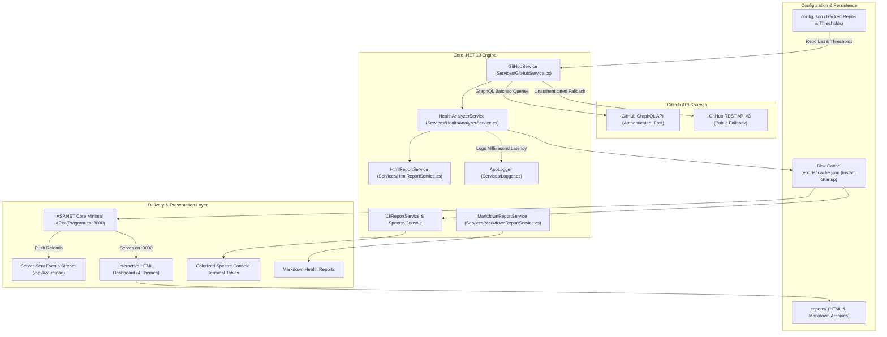
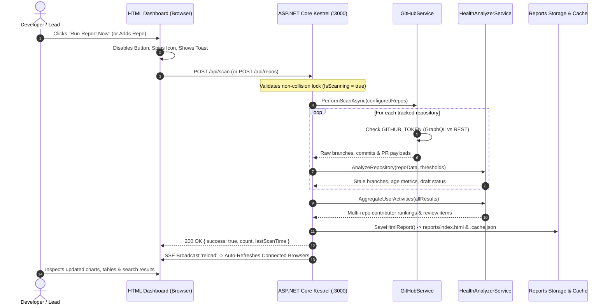

# fluffy-sniffle 🔍⚡

<div align="center">


<br/>

**An enterprise-grade, high-performance GitHub repository health & contributor analytics engine built on .NET 10.**  
*Track stale branches, audit open pull requests, benchmark team activities, and eliminate technical debt across multiple repositories.*

</div>

---

## 👤 Author & Creator

| Detail | Information |
| :--- | :--- |
| **Creator & Owner** | **EldieBeldie** |
| **GitHub** | [@EldieBeldie](https://github.com/EldieBeldie) |
| **Email** | [eldargr@gmail.com](mailto:eldargr@gmail.com) |
| **Code Ownership** | Defined in [`.github/CODEOWNERS`](.github/CODEOWNERS) (`@EldieBeldie`) |
| **Project** | [fluffy-sniffle](https://github.com/EldieBeldie/fluffy-sniffle) |

> *"Built to provide engineering teams with crystal-clear visibility into repository hygiene, cross-project contributor momentum, and open PR bottlenecks without friction."*

---

## 🏛️ System Architecture (.NET 10)

`fluffy-sniffle` is architected as an asynchronous, event-driven dual-engine inspection pipeline running on **.NET 10**, **C# 13**, and **ASP.NET Core Minimal APIs**. It connects with GitHub via authenticated GraphQL or unauthenticated REST, analyzes branch and PR health trees, aggregates developer metrics across multiple repositories, and provides sub-millisecond route handling with live Server-Sent Events (SSE) browser reloading.

### 📐 High-Level Architectural Flow



---

### 🔄 In-Page On-Demand Scan Sequence

When you trigger a scan directly from the web interface, the following asynchronous lifecycle executes:



---

## ✨ Features & Capabilities

- **🚀 Blazing Native Performance (.NET 10):** Sub-millisecond route handling, native async I/O pipelines, and sub-50ms instant startup from disk cache.
- **🏢 Repository Health View:** Inspect default branches, private/public status, and categorized branch lists with staleness counters.
- **👤 Contributor Activities & All-Time Details:**
  - **All-Time Scope Option:** Toggle between `🌐 All Times (Complete History)` and `⚠️ Needs Attention Only` with instant switching and persistence in `localStorage`.
  - **All-Time Pull Requests & Branches:** View complete contributor work including merged PRs, closed PRs, active branches, stale branches, and acceptance merge rates.
  - **In-Card Interactive Filter Tabs:** Filter PRs (`All`, `Open`, `Merged`, `Closed`) and branches (`All`, `Active`, `Stale`) directly inside each contributor card.
  - **CLI Support:** Run `dotnet run -- --all-time` for colorized terminal tables with complete contributor lifespans and metrics.
- **🔍 Global Instant Search Engine:**
  - Full-text search across PR titles, PR numbers, branch names, commit authors, and repository names.
  - Category filter chips: `All`, `Pull Requests`, `Branches`, `Contributors`, `Repositories`.
  - In-place `<mark>` keyword highlighting.
  - Keyboard shortcuts: Press <kbd>/</kbd> to focus, <kbd>Escape</kbd> to clear.
- **🔄 In-Browser Interactive Controls:**
  - **"Run Report Now" button:** Trigger fresh scans on demand with zero page reloads needed.
  - **"Add Repo" input:** Add new repositories (`owner/repo`) right from the web header to persist and scan instantly.
- **📡 Dual API Architecture:**
  - **GraphQL (Primary):** Authenticated via `GITHUB_TOKEN` for 5,000 req/hr rate limit and batched single-query tree fetches.
  - **REST v3 (Fallback):** Works unauthenticated out of the box for public repositories.
- **🎨 4 Accessible Visual Themes & Section 508 / WCAG Compliance:**
  - 🌙 **Dark (Default):** Deep slate background (`#0f172a`), refined borders, and gentle accents.
  - ☀️ **Light:** Crisp daytime layout with high contrast ($\ge 4.5:1$ contrast ratio).
  - 🌌 **Midnight:** Oceanic navy palette with vivid cyan and sapphire accents.
  - 👁️ **High Contrast (Section 508 / WCAG AAA):** Pure black (`#000000`) canvas, pure white (`#ffffff`) text, high-visibility borders ($\ge 7:1$ contrast ratio).
  - **Section 508 Features:** Skip-to-content navigation links, visible focus indicator rings (`:focus-visible`), dual visual indicators (icons + text labels), semantic table headers (`scope="col"`), screen-reader labels (`.sr-only`), and `localStorage` persistence.
- **⏱️ Request Duration Telemetry:** Exact request execution time logging (`METHOD /path -> STATUS (XXms)`) for all HTTP endpoints and GitHub API calls.

---

## 🛠️ Quickstart & Setup

### Prerequisites
- [.NET 10 SDK](https://dotnet.microsoft.com/download) (or later)

### 1. Clone & Build
```bash
git clone https://github.com/EldieBeldie/fluffy-sniffle.git
cd fluffy-sniffle
dotnet build
```

### 2. Configure GitHub Token (Recommended)
Copy the environment template:
```bash
cp .env.example .env
```
Add your GitHub Personal Access Token to `.env`:
```env
GITHUB_TOKEN=ghp_your_token_here
```
*(Classic token with `repo` scope, or Fine-grained token with `Pull requests: Read` & `Contents: Read`).*

---

## ⚙️ Configuration (`config.json`)

Configure stale thresholds and your target repositories in `config.json`:

```json
{
  "defaultStaleDays": 30,
  "warnStaleDays": 60,
  "repositories": [
    { "owner": "expressjs", "repo": "express" },
    { "owner": "fastify", "repo": "fastify" },
    { "owner": "octokit", "repo": "octokit.js" },
    { "owner": "sindresorhus", "repo": "chalk" }
  ]
}
```

---

## 📖 Usage

### 🌐 Launch the Interactive Web Dashboard
```bash
# Starts the ASP.NET Core server on http://localhost:3000 and opens your browser:
dotnet run -- --open

# Or run server only without auto-opening browser:
dotnet run
```

### ⚡ Live Dev Mode with Hot Reload
```bash
dotnet watch run -- --dev
```
*Watches project files and `config.json`. Connected browsers receive live SSE signals and reload automatically on updates.*

### 💻 CLI Runner (Terminal / CI-CD Mode)
```bash
# Scan configured repositories in terminal with Spectre.Console tables:
dotnet run -- cli

# Scan an ad-hoc repository on-the-fly:
dotnet run -- facebook/react

# Include all-time contributor lifetime metrics:
dotnet run -- cli --all-time

# Export Markdown summary report:
dotnet run -- cli --markdown
```

---

## 🐳 Docker Deployment

A lightweight, multi-stage **Alpine Linux** container is provided for production deployments:

### Build and Run with Docker Compose
```bash
docker compose up -d --build
```
Access the dashboard at `http://localhost:3000`. Reports are automatically persisted in `./reports/` on your host machine.

### Manual Docker Build
```bash
docker build -t fluffy-sniffle .
docker run -d -p 3000:3000 --env-file .env -v ${PWD}/reports:/app/reports fluffy-sniffle
```

---

## 📄 License

This project is licensed under the MIT License - see the [LICENSE](LICENSE) file for details.  
Maintained by **[EldieBeldie](https://github.com/EldieBeldie)** (`eldargr@gmail.com`).